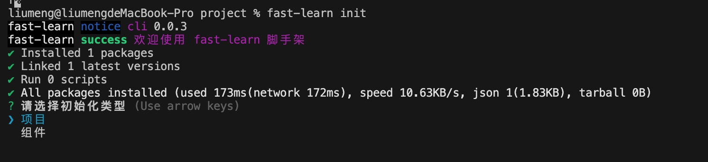
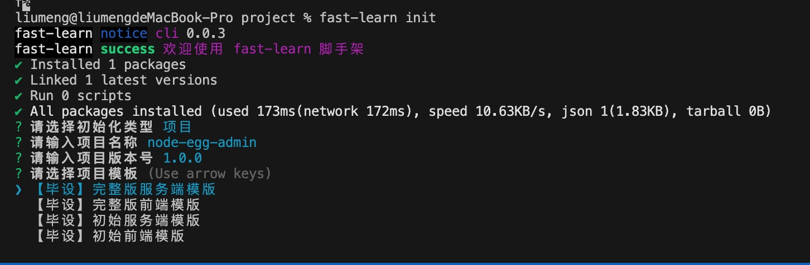

# fast-learn
> 源码地址：[https://github.com/fast-learn/cli](https://github.com/fast-learn/cli)

## fast-learn 使用流程

1. 创建项目：创建存放项目模版的文件夹

```bash
mkdir project
```

2. 执行安装命令：执行脚手架命令安装模版

```bash
fast-learn init
```

3. 选择模版类型：选择安装模版的类型为组件
   > fast-learn 是为课程搭建的脚手架命令，组件模版暂时还没有进行更新，等课程更新时会对应更新组件模版
   > 
4. 输入项目描述：根据提示输入项目名称和版本号
   
5. 选择安装的项目模版：根据自己的需求下载对应的项目模版，这里我们选择【毕设】初始前端模版进行开发
   
6. 启动项目：选择项目安装模版后，fast-leaen 会自动帮我们安装依赖并启动项目

## 模版介绍

- 【管理后台】前端模板 ：基础版的前端源码
- 【管理后台】服务端模板 ：基础版的服务端源码
