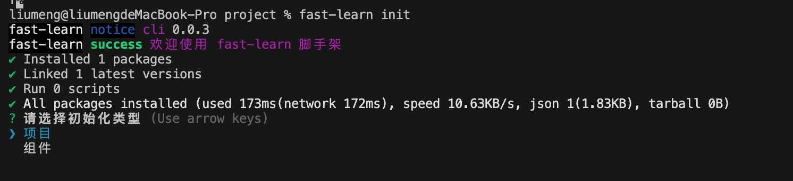
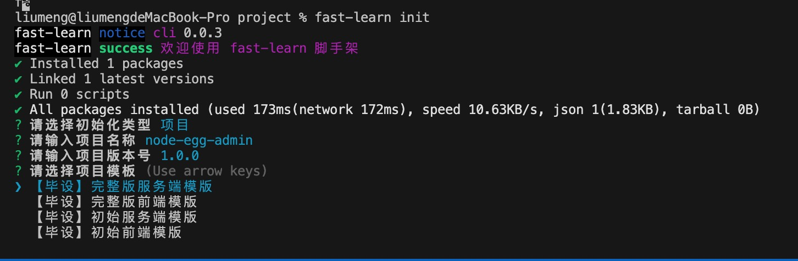
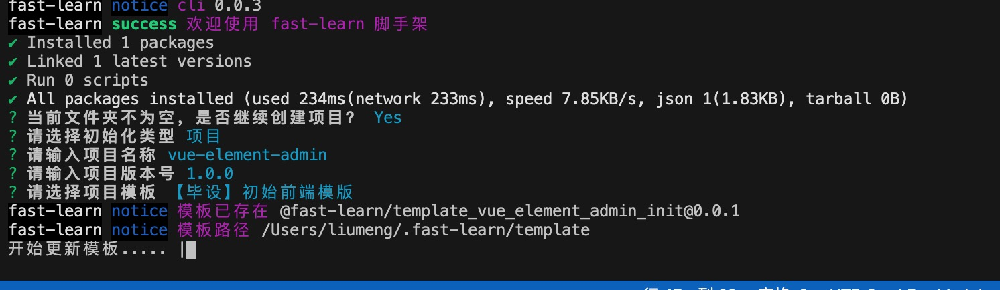
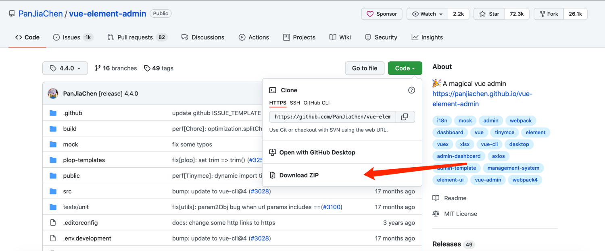
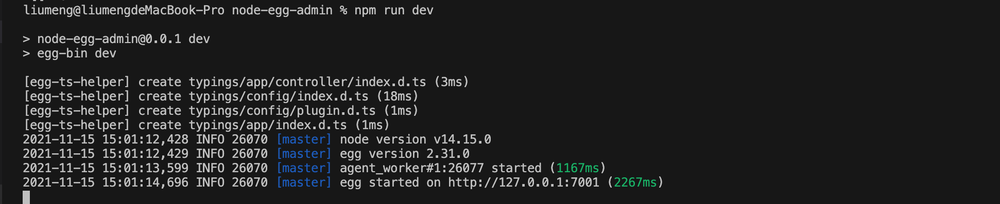
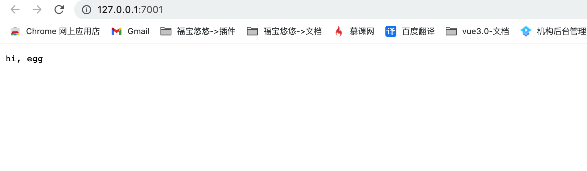
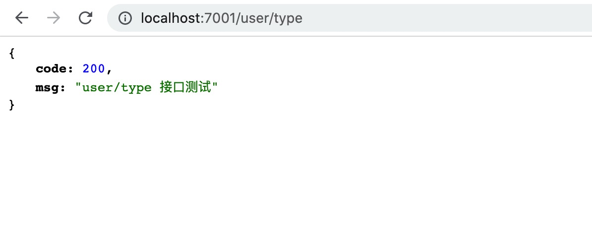
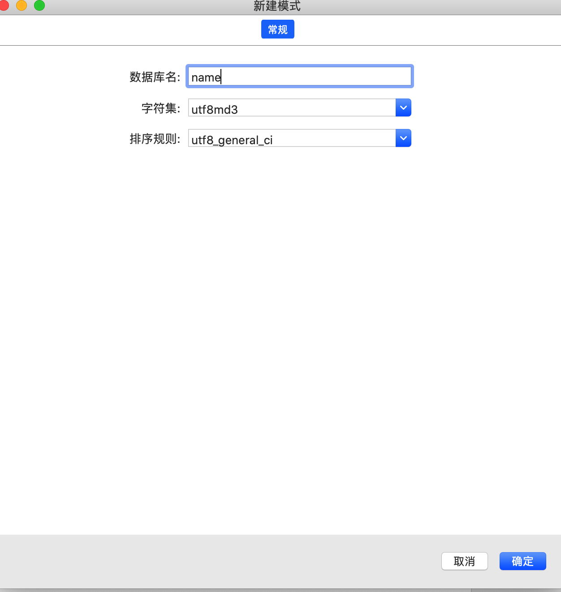
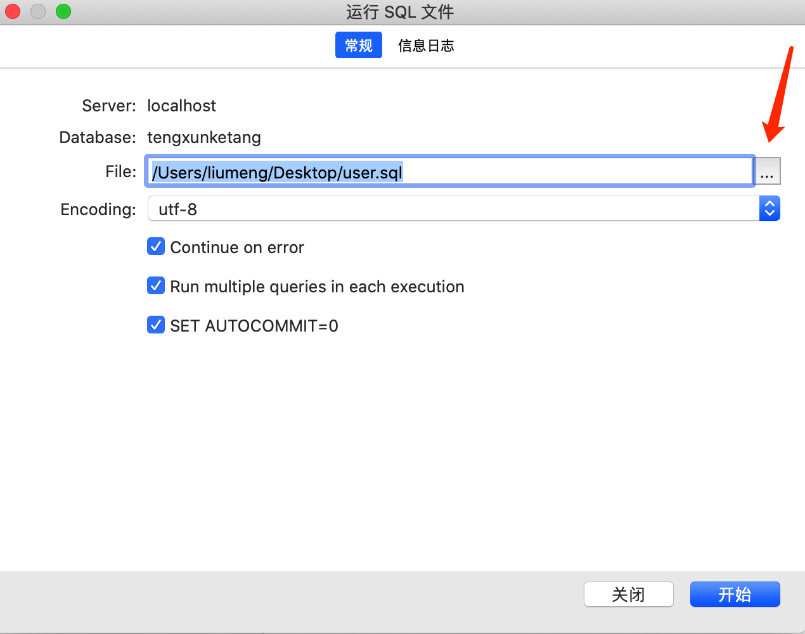
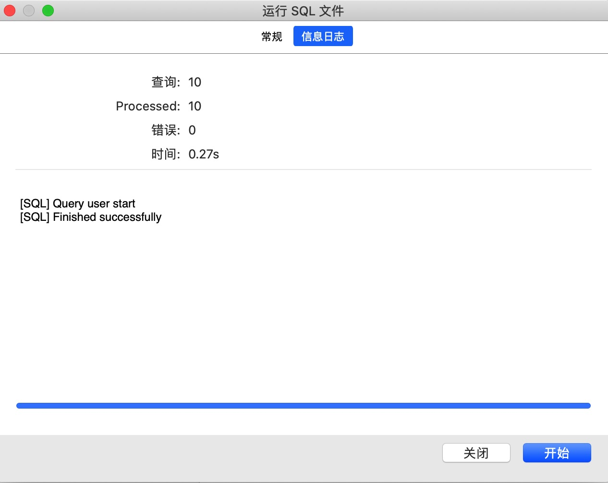

# 初始化阶段

## fast-learn 
> fast-learn 源码地址：[https://github.com/fast-learn/cli](https://github.com/fast-learn/cli)

### fast-learn 使用流程

1. 创建项目：创建存放项目模版的文件夹

```bash
mkdir project
```

2. 执行安装命令：执行脚手架命令安装模版

```bash
fast-learn init
```

3. 选择模版类型：选择安装模版的类型为组件
   > fast-learn 是为课程搭建的脚手架命令，组件模版暂时还没有进行更新，等课程更新时会对应更新组件模版

   
4. 输入项目描述：根据提示输入项目名称和版本号
   
5. 选择安装的项目模版：根据自己的需求下载对应的项目模版，这里我们选择【毕设】初始前端模版进行开发
   
6. 启动项目：选择项目安装模版后，fast-leaen 会自动帮我们安装依赖并启动项目

### 模版介绍

- 【管理后台】前端模板 ：基础版的前端源码
- 【管理后台】服务端模板 ：基础版的服务端源码

## 前端项目初始化
### 源码模式

1. 下载模版项目：点击文档中的链接下载模版文件代码
   > [模版文件代码](https://github.com/PanJiaChen/vue-element-admin/tree/4.4.0)
   > 
2. 安装依赖：解压项目源码，进入项目，打开控制台安装项目依赖包

```bash
npm install 或 cnpm install 或者 yarn add
```

3. 启动模版项目：依赖安装完成后根据 package.json 中 scripts 的命令启动项目

```bash
npm run dev
```

4. 常见问题：项目启动过程中如果遇到 core-js 的报错，可以在项目中安装最新版本的 core-js

```bash
npm install core-js@3.19.1
```

### 脚手架模式

1. 全局安装脚手架

```bash
npm install fast-learn -g
```

2. 使用方式

```bash
fast-learn init
```

## 服务端项目初始化

### 源码模式

1. 新建项目文件: 在本地创建 node-egg-admin 文件夹

```bash
mkdir node-egg-admin
```

2.  生成项目：进入文件夹在控制台输入如下命令生成服务端项目

```bash
npm init egg --type=simple
```

3.  安装依赖：安装项目中使用的依赖

```bash
npm install 或 cnpm install 或者 yarn add
```

4. 启动项目：查看 package.json 中的启动命令，通过 npm run dev 或者 yarn dev 执行启动命令启动服务端项目

```json
"scripts": {
 "start": "egg-scripts start --daemon --title=egg-server-node-egg-admin",
 "stop": "egg-scripts stop --title=egg-server-node-egg-admin",
 "dev": "egg-bin dev",
 "debug": "egg-bin debug",
 "test": "npm run lint -- --fix && npm run test-local",
 "test-local": "egg-bin test",
 "cov": "egg-bin cov",
 "lint": "eslint .",
 "ci": "npm run lint && npm run cov",
 "autod": "autod"
}
```

5. 接口访问测试: 项目启动后看到如下图所示，表示项目已经启动可以点击下面的链接进行访问


### 脚手架模式

- 通过 fast-learn 脚手架安装

```bash
fast-learn init
```


## 服务端新增测试接口
1. 添加接口文件：在 app/controller 下添加 user.js

```js
'use strict'
const Controller = require('egg').Controller

class UserController extends Controller {
  async type() {
    const { ctx } = this
      ctx.body = { code: 200, msg: 'user/type 接口测试' }
  }

module.exports = UserController
```

2. 添加接口配置：在 app/router 中配置 user/type 端口

```js
router.get('/user/type', controller.user.type)
```

3. 接口测试：在地址栏输入接口地址进行测试 (http://127.0.0.1/user/type)
   
## 数据库初始化
### 下载插件

#### mysql

> MySQL 是关系型数据库，其开放式的架构使得用户的选择性很强，而且随着技术的逐渐成熟，MySQL 支持的功能也越来越多，性能也在不断地提高，对平台的支持也在增多，此外，社区的开发与维护人数也很多。当下，MySQL 因为其功能稳定、性能卓越，且在遵守 GPL 协议的前提下，可以免费使用与修改，因此深受用户喜爱

- [下载地址：](https://dev.mysql.com/downloads/mysql/) https://dev.mysql.com/downloads/mysql/

#### Navicat

> Navicat Premium 是一套数据库开发工具，让你从单一应用程序中同时连接 MySQL、MariaDB、MongoDB、SQL Server、Oracle、PostgreSQL 和 SQLite 数据库。它与 Amazon RDS、Amazon Aurora、Amazon Redshift、Microsoft Azure、Oracle Cloud、MongoDB Atlas、阿里云、腾讯云和华为云等云数据库兼容。你可以快速轻松地创建、管理和维护数据库。

- [下载地址：](https://www.navicat.com.cn/products/navicat-premium) https://www.navicat.com.cn/products/navicat-premium

### 导入数据
> [数据库文件地址](https://fast-learn.youbaobao.xyz/user.sql) 
1. 新建数据库：打开 Navicat 新建数据库, 右击 localhost 连接，新建数据库
   
2. 运行文件：右击新建的数据库，选择 “运行 SQL 文件” 点击下图红色箭头文件，选择本地的数据库文件进行导入
   
3. 导入数据：点击开始按钮即可导入数据
   


## 服务端连接据库
1. 安装模块：在项目中安装对应的模块 egg-mysql
   > (egg-mysql [文档地址](https://www.npmjs.com/package/egg-mysql))

```bash
npm install egg-mysql -S
```

2. 开启模块：在 config/plugins.js 配置中开启模块

```js
exports.mysql = {
  enable: true,
  package: 'egg-mysql'
}
```

3. 创建配置文件：在 config 下创建 db.js 存放个人数据库连接信息

```js
/* mysql */
const MYSQL_HOST = 'localhost' // host地址 没有进行地址映射默认为127.0.0.1
const MYSQL_PORT = '3306' // 默认3306
const MYSQL_USER = 'root' // 数据库用户名
const MYSQL_PWD = 'xx' // 数据库密码
const MYSQL_DB = 'xx' // 数据库名

module.exports = {
  MYSQL_HOST,
  MYSQL_PORT,
  MYSQL_USER,
  MYSQL_PWD,
  MYSQL_DB
}
```

4. 连接数据库：在 config/config.default.js 中导入 db.js 进行数据库连接

```js
const {
  MYSQL_DB,
  MYSQL_PWD,
  MYSQL_USER,
  MYSQL_PORT,
  MYSQL_HOST
} = require('./db')

config.mysql = {
  client: {
    host: MYSQL_HOST,
    port: MYSQL_PORT,
    user: MYSQL_USER,
    password: MYSQL_PWD,
    database: MYSQL_DB
  },
  app: true,
  agent: false
}
```
## 接口调用数据库测试
1. 查询数据库：在 app/controller/user.js 中使用 SQL 语句查询数据库

```js
'use strict'

const Controller = require('egg').Controller

class UserController extends Controller {
  async type() {
    const { ctx，app} = this
    const user = await app.mysql.select('user') // user 是数据库中的表名
     ctx.body = user
  }
}

module.exports = UserController
```

2. 接口测试：在地址栏中输入 http://127.0.0.1/user/type 进行接口测试, 能够正常看到数据库 user 表的所有内容就表示测试通过

## 前端模版修改

1.  清空默认内容：清空模版项目中登录组件默认指定的用户名和密码

```js
data() {
  return{
    loginForm: {
        username: '',
        password: ''
      },
  }
}
```

2. 校验规则修改：修改模版项目中登录组件的用户名校验规则, 校验规则文件：src/utils/validate.js

> 模版文件中用户名使用的是自定义校验指定了必须为 'admin' 或 'editor', 你可以根据需要在这里添加自定义规则。我这里为了方便测试就简单的添加了可以通过的用户名。

```js
export function validUsername(str) {
  const valid_map = ['testuser', 'admin', 'editor']
  return valid_map.indexOf(str.trim()) >= 0
}
```

3.  登录页面修改：删除登录页面中登录按钮下方的提示类信息,让登录页面更加整洁
    > 这里的内容可以根据自己的需要进行使用。

```js
<div style="position:relative">
  <div class="tips">
    <span>Username : admin</span>
    <span>Password : any</span>
  </div>
  <div class="tips">
    <span style="margin-right:18px;">Username : editor</span>
    <span>Password : any</span>
  </div>
  <el-button class="thirdparty-button" type="primary" @click="showDialog=true">
  Or connect with
  </el-button>
</div>
```

