# 前端权限管理

## 用户管理

### 用户列表
需求设计如下：
+ 将查询到的信息展示在列表中，列表中无需展示用户的权限信息，需要支持分页
+ 用户翻页后，刷新页面时需要保持当前页码状态
+ 用户手动修改 url 中的 page 参数，当 page 参数大于当前最大页数时，自动选择最后一页
+ 支持用户名、昵称、邮箱搜索，搜索内容高亮显示
+ 效果图：
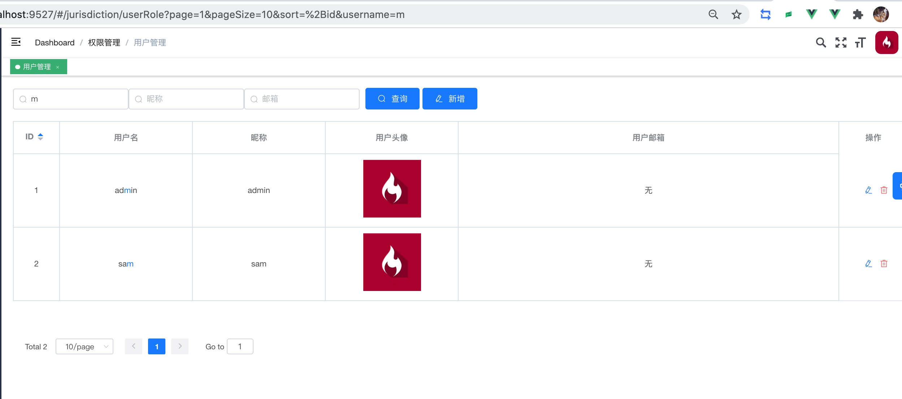

###  添加用户
需求设计如下：
+ 点击新增按钮，弹出新增用户对话框
+ 在新增用户表单弹出时，需要查询 role 表，获取所有的角色信息，并将角色信息填充到 select 多选组件中
+ 用户点击上传组件进行头像上传，上传时调用一个服务端接口，将图片上传至 nginx 服务器，上传成功后返回前端用户头像的 url
+ 用户填写表单信息后，需选择用户关联的角色，角色支持多选
+ 保存时，进行必填项校验，必填项信息如下：
  + 必填项：
    + 用户名（username）
    + 密码（password）
    + 用户昵称（nickname）
    + 用户角色
  + 非必填项：
    + 用户头像（avatar）
    + 用户邮箱（email）
+ 效果图：
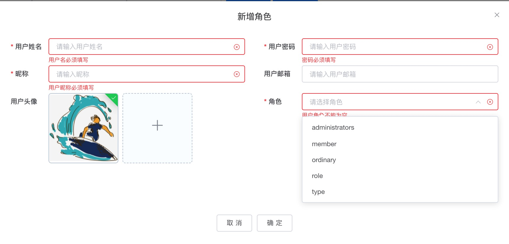

###  删除用户
+ 效果图：
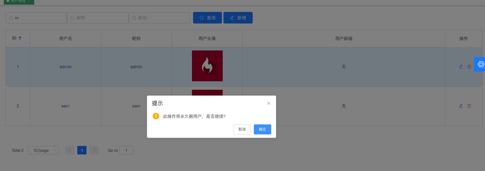

### 编辑用户
需求设计如下：
+ 点击列表中用户后的编辑按钮，弹出编辑用户对话框
+ 在编辑用户表单弹出时，需要将用户信息显示在用户对话框中，并且获取所有的角色信息，并将角色用户填充到 select 多选组件中，并查询当前用户匹配的角色信息，将这些角色信息默认置为选中状态
+ 如果用户默认有头像，则在 Upload 组件中展示用户的头像图片
+ 编辑保存时，必填项校验逻辑和新增时完全一致
+ 效果图
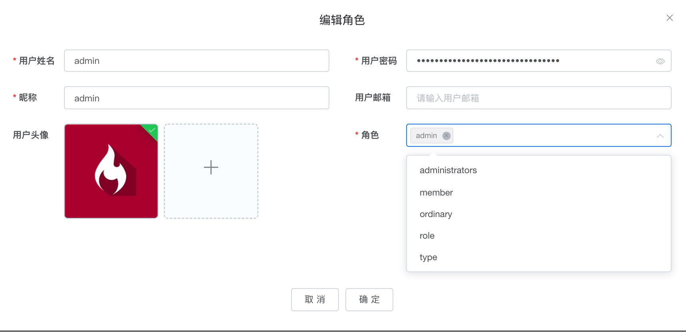

## 角色管理

### 获取角色列表
需求设计如下：
+ 将查询到的信息展示在列表中，列表不需要支持翻页，也不需要支持查询，需要支持排序
+ 效果图：
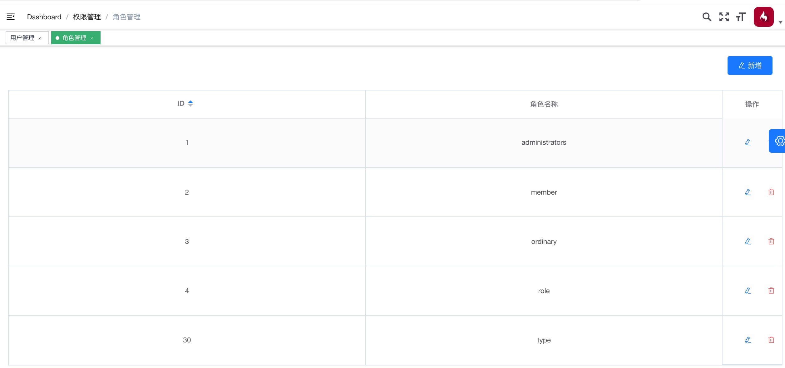

### 添加角色
需求设计如下：
+ 点击新增按钮，弹出新增角色对话框，弹窗样式见原型设计
+ 新增角色弹窗打开时，需要查询 menu 表，将所有的菜单数据展示在树形控件中，树形控件可参考 element-ui 库的 可选择 tree 组件：[tree 组件](https://element.eleme.cn/#/zh-CN/component/tree)
+ 打开新增对话框时，默认值如下：
  + 名称：默认为空
  + 菜单：默认为空
+ 保存时，进行必填项校验，必填项信息如下：
  + 必填项：
    + 名称（name）
    + 菜单
+ 效果图
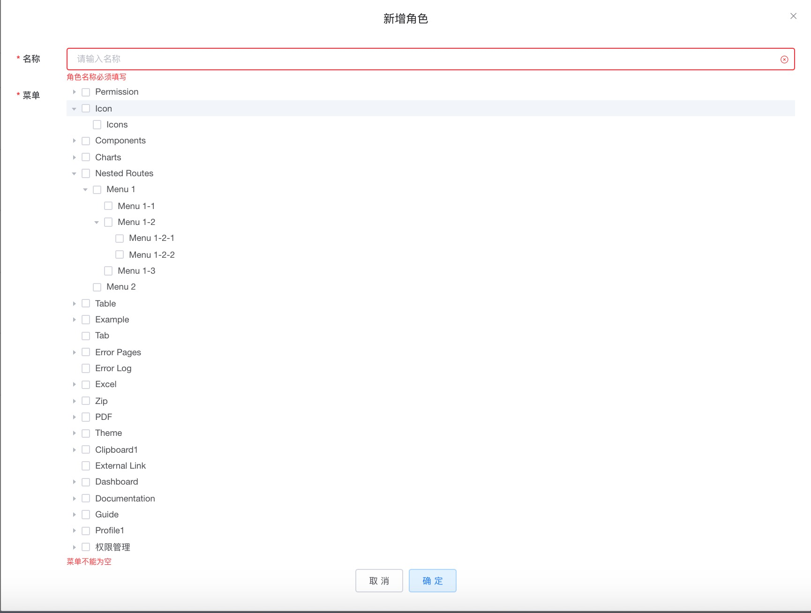

### 编辑角色
需求设计如下：
+ 点击列表中菜单后的编辑按钮，弹出编辑角色对话框
+ 在编辑用户表单弹出时，需要查询 menu_role 表，并将当前角色关联的菜单置为选中状态
+ 编辑保存时，必填项校验逻辑和新增时完全一致
+ 效果图
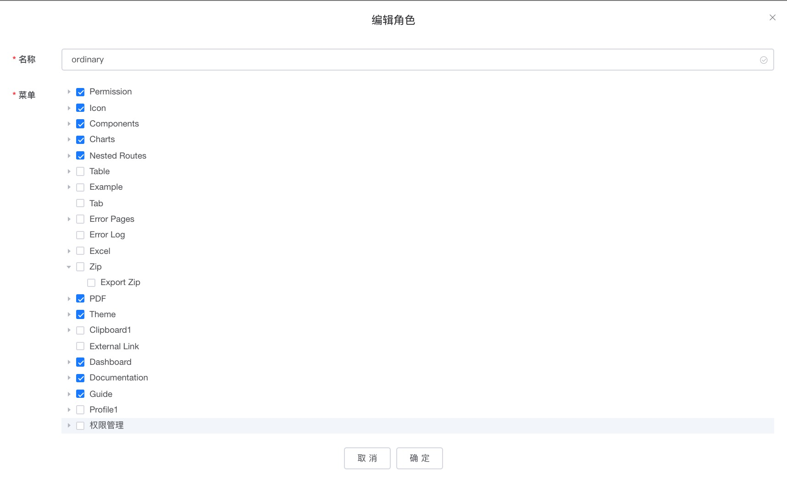

### 删除角色
需求设计如下：
+ 删除角色前需要判断 menu_role 表中该 role_id 是否存在，如果存在，则不允许删除，并提示：该角色已关联菜单，不允许删除！
+ 上述判断如果 menu_role 表中没有 role_id 记录，则查询 user_role 表中是否存在该 role_id，如果存在，则不允许删除，并提示：该角色已关联用户，不允许删除！
+ 如果该角色在 menu_role 和 user_role 表中都不存在，则允许删除
+ 效果图
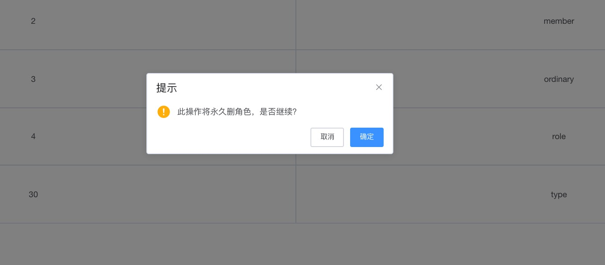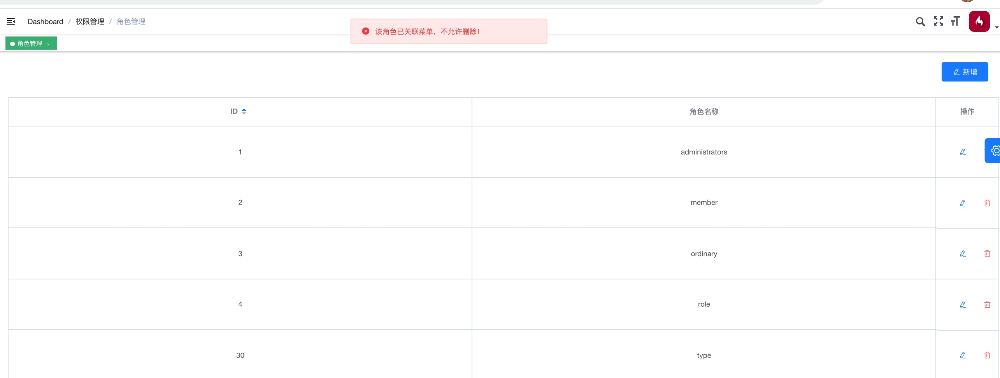

## 菜单管理

###  获取菜单列表
需求设计如下：
+ 将查询到的信息展示在列表中，列表不需要支持翻页，也不需要支持查询，需要支持排序操作
+ 菜单需要支持树形列表显示，该控件 element-ui 已支持[官网地址](https://element.eleme.cn/#/zh-CN/component/table)
+ 效果图
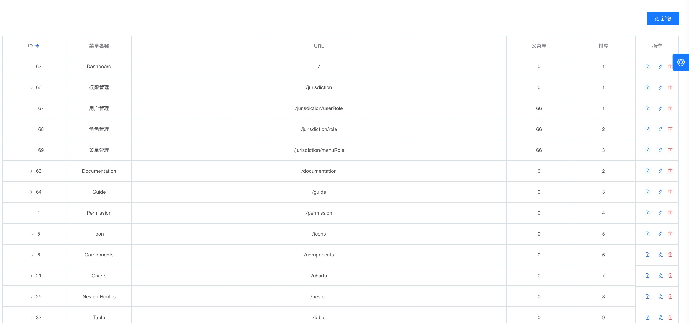
### 添加菜单
需求设计如下：
+ 点击新增按钮，弹出新增菜单对话框
+ 点击菜单项后面的添加按钮，默认其父菜单为该菜单项
+ 父菜单是一个  Select 组件，单选，其值为顶级菜单 + 所有菜单名称，顶级菜单的 id 为 0，该数据不用写入数据库。
+ 打开新增对话框时，默认值如下：
  + 名称：默认为空
  + URL：默认为空
  + 父菜单：默认选中顶级菜单
  + 排序：默认为 1
+ 保存时，进行必填项校验，必填项信息如下：
  + 必填项：
    + 名称（name）
    + URL（url）
    + 父菜单（pid）
    + 排序（sort）
+ 效果图
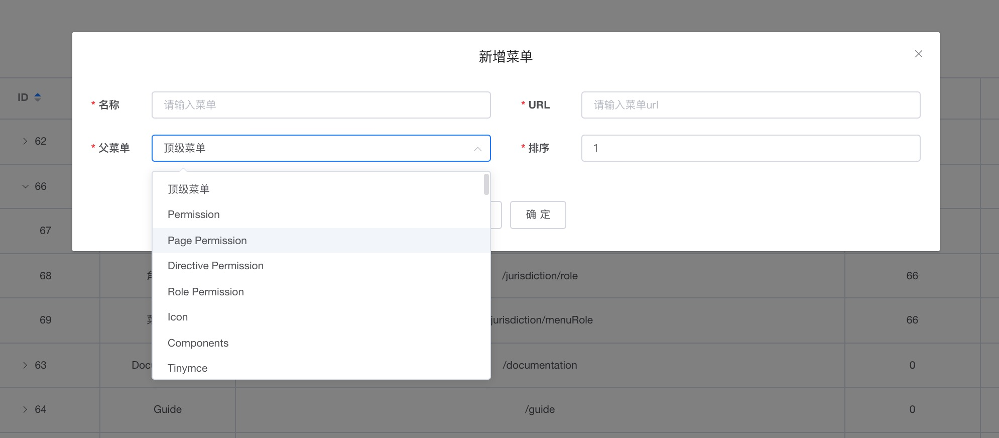

### 编辑菜单
需求设计如下：
+ 点击列表中菜单后的编辑按钮，弹出编辑用户对话框
+ 在编辑用户表单弹出时，需要将当前菜单信息显示在对话框的表单中，并且获取所有的菜单信息，并将菜单信息填充到 select 组件的下拉列表中，并根据当前菜单的 pid，自动将该 pid 置为选中状态
+ 编辑保存时，必填项校验逻辑和新增时完全一致
+ 效果图：
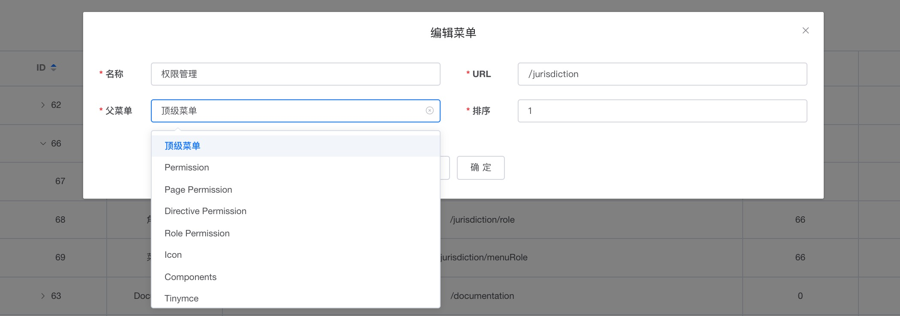
### 删除菜单
需求设计如下：
+ 删除菜单时如果 menu_role 表中存在该 menu_id 的记录，则不允许删除
+ 效果图
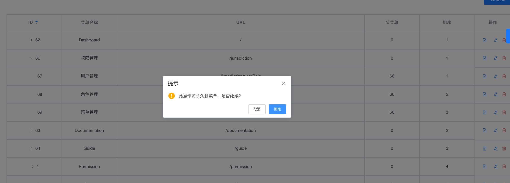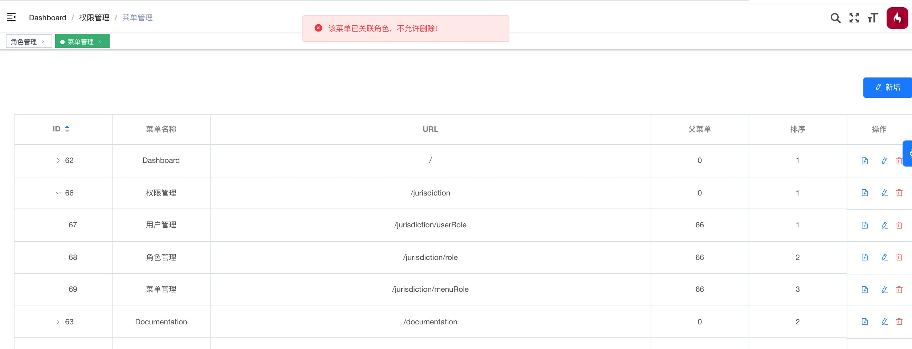

### 动态菜单
需求设计如下：
+ 用户登录成功后调用 getUserInfo 根据 携带的 token 获取用户信息和用户权限信息
+ 用户权限信息获取成功后，调用 getUserMenu 接口获取用户所拥有的菜单项
+ 将菜单项添加到路由表中并存入 vuex，开启渲染